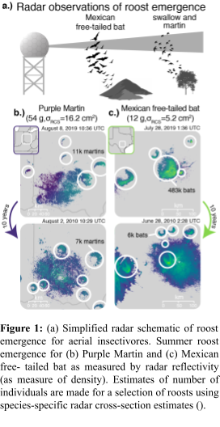

# RoostCanada
## Background: 
Aerial insectivores are experiencing population declines in Canada. Among insectivores, swallows and martins form communal nighttime roosts in the non-breeding season that are often visible on weather radar as birds depart the roost en masse in the morning. These roosts present a unique opportunity to study these bird populations, including their distribution, specific important habitats used, numbers, and phenology, in a way that can guide conservation. Machine learning algorithms to detect and track roosts in US radar data were developed by researchers at the College of Information and Computer Sciences at the University of Massachusetts Amherst. The main goal of this work is to adapt those algorithms to Canadian weather radar data and form a preliminary assessment of their accuracy. If successful, future work can analyze roosts in Canadian radar data at a larger scale. If preliminary assessments show that the US system does not translate with sufficient accuracy, future work can focus on collecting labeled training data for Canadian roosts and fine-tuning models to increase accuracy.

Figure 1 shows a schematic of the roost emergence and detection process, and how it can be used to estimate the numbers of aerial insectivores in the atmosphere. The figure illustrates both swallows and martins (daytime emergence) and bats (nighttime emergence); this contact will focus only on swallows and martins.

